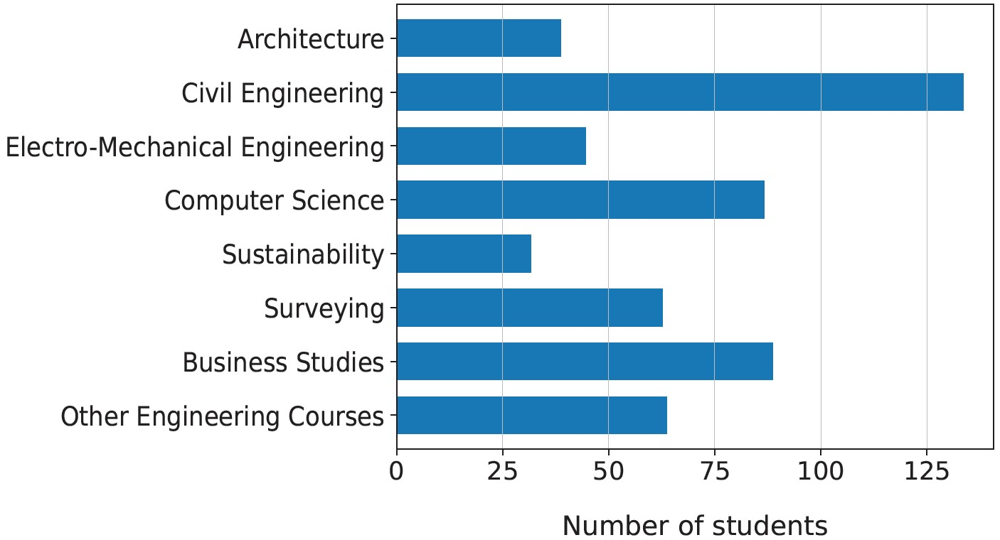
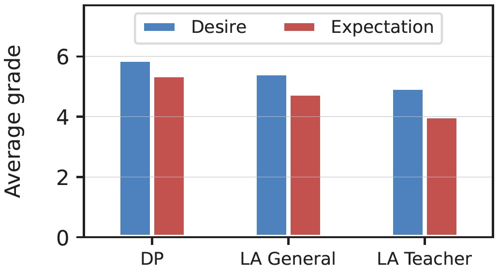
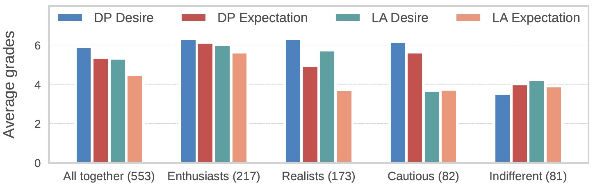

# Exploring Student Expectations and Confidence in Learning Analytics

*The purpose of this repository is to archive program code and publications related to the Acceptance Study for Learning Analytics (part of the Digital Mentoring project, 2021-2024).*

**Project Team:** H. Asatryan, H. Bijl, J. Frochte, C. Frohn-Schauf, J. Mohr, M. Neugebauer, P. Spiegelberg and B. Tousside

**Institution:** Bochum University of Applied Sciences, Department of Electrical Engineering and Computer Science

**Research set-up**

The project Digitales Mentoring investigates the application of Learning Analytics (LA) and machine learning in education. Part of that investigation is a study of how willing students are to accept LA applications. The internationally renowned [Student Expectation of Learning Analytics Questionnaire (SELAQ)](https://onlinelibrary.wiley.com/doi/full/10.1111/jcal.12366) has been used for this. This survey consists of twelve pairs of statements.

- Five pairs of statements concern Data Protection (DP).
- Five pairs of statements concern the application of LA in general/by the organization.
- Two pairs of statements concern the application of LA by the teachers.

For each pair of statements, there are two substatements “I wish that this ideally takes place” (desire) and “I assume that this really happens” (expectation). Answers are given on a seven-point Likert-scale. On top of this the survey also has four open questions about potential opportunities and pitfalls.

The survey has been filled in by 553 first-year students. These are spread out across study tracks.

**Results**

The students from the HS BO have responded similarly to the students from other studies in other European countries. On average they seem to value DP and mostly think this is done well. They also see potential in the application of LA, mainly on an organizational level.

However, further insights can be gained by performing a clustering analysis of the students. This loosely divides the students into four groups, which have been named accordingly.

- The **Enthusiasts** (39%) value DP and LA and think it is currently done well.
- The **Realists** (31%) value DP and LA but think its application has room for improvement.
- The **Cautious** students (15%) value DP and think it is done well, but care less about LA.
- The **Indifferent** students (15%) do not strongly value either DP or LA.

There was not a strong correlation between cluster and study track. Sustainability students are slightly more likely to be enthusiasts, architecture students are more often realists and business studies have more indifferent students. However, these trends are all rather weak. Generally every study track has every type of student well-accounted for.

The open questions show a few consistent patterns among students. What many students want is a clear overview of their progress within their courses. By directly seeing an image of their past successes and their upcoming steps, they expect their motivation to increase. What they fear from LA is more monitoring, and as a result less independence and even more pressure.

**Conclusions and recommendations**

When applying learning analytics, there are a few important factors to consider.

- Data Protection must be set up well. Most students (Enthusiasts, Realists and Cautious: 85%) find this of high importance.
- The added value for students must be clear. While most students (Enthusiasts and Realists: 70%) are eager about the opportunities, there are still many skeptical students who must be included as well.
- The application of LA must be set up properly. Currently many students (Realists, Cautious and Indifferents: 61%) seem to be skeptical about how well the university applies LA. An ineffective application might further erode that trust.

It is also important to use LA in the right way. Students mainly indicate that a clear overview of their learning progress within courses is most likely to help them, increasing their study motivation. LA should not be used to further monitor and pressure students into working harder.

The described results are published as a conference paper:

 - Asatryan H., Tousside B., Mohr J., Neugebauer M., Bijl H., Spiegelberg P., Frohn-Schauf C., Frochte J.  (2024). *Exploring Student Expectations and Confidence in Learning Analytics.* In: Proceedings of the 14th Learning Analytics and Knowledge Conference (LAK24). [DOI: 10.1145/3636555.3636923](http://dx.doi.org/10.1145/3636555.3636923)
